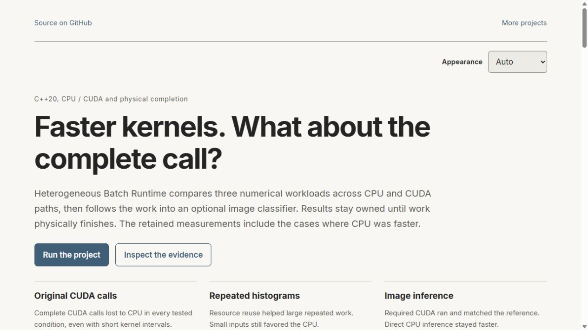

# Heterogeneous Batch Runtime

I am building a small native runtime to compare three numerical workloads across CPU and GPU execution. The first implementation provides C++20 scalar references, optimized CPU paths and a narrow Python interface. The workloads expose different costs: masked reduction, tiled histogram counts and a 3 by 3 image stencil.

The runtime keeps submitted work alive until it actually finishes. Cancelling a running operation records a request. It does not pretend that the operation stopped or that its storage can already be reused.

[Explore the project and its retained measurements](https://t92t1914.github.io/heterogeneous-batch-runtime/). The browser page compares the saved CPU and CUDA results, including cases where an optimized path was slower. It explains what each timing includes and keeps the complete call separate from kernel time.

[](https://t92t1914.github.io/heterogeneous-batch-runtime/)

## Build and inspect

Use CMake 3.24 or later and a C++20 compiler. Build with a conservative parallel limit on a shared machine.

```sh
cmake -S . -B build -DCMAKE_BUILD_TYPE=Release
cmake --build build --config Release --parallel 2
ctest --test-dir build -C Release --output-on-failure
```

On GCC or Clang, configure a separate Debug build with `-DHBR_SANITIZERS=ON` for AddressSanitizer and UndefinedBehaviorSanitizer. Do not treat a configured job as executed evidence.

The optional Python package uses pybind11 and NumPy:

```sh
python -m pip install .
python -m pytest tests/python
```

```python
import numpy as np
from heterogeneous_batch_runtime import masked_reduce

values = np.array([2.0, -3.0, 5.0], dtype=np.float64)
mask = np.array([1, 0, 1], dtype=np.uint8)
print(masked_reduce(values, mask))  # 7.0
```

`tile_histogram` accepts a two-dimensional uint8 array and tile height and width. `stencil3x3` accepts a two-dimensional float64 array and copies its outer border. Every operation accepts `backend="scalar"` or `backend="optimized"` and a thread count. Python inputs are snapshotted before native work releases the GIL. No implicit dtype conversion occurs.

## What the implementation compares

The CPU path uses runtime-dispatched AVX2 for reduction and stencil work, with a portable fallback. Histogram workers own separate tiles and use private bin banks. Parallelism is bounded by the requested thread count. The [contracts](docs/contracts.md) define layout, edge behavior, cancellation and numerical tolerances.

The [CPU protocol](docs/cpu-protocol.json) fixes the initial measurement conditions. It retains the first invocation and every warm sample, including slower optimized cases. Native operation time includes validation and allocation. It excludes Python conversion, queueing and GPU transfers. Those require separate measurements.

The optional CUDA backend uses a completed synchronous C++ interface. Configure with `-DHBR_CUDA=ON` and the CUDA architecture for the actual device. Its tests execute on a compatible GPU. The [GPU protocol](docs/cuda-protocol.json) compares global and shared histogram atomics and retains transfer, kernel and completed host timings separately. The default Python wheel remains a CPU interface. An [explicit optional Python build](docs/python-cuda.md) exposes the existing reusable histogram through owned snapshots and a dedicated resource owner.

Native installation exports `hbr::hbr` and, when enabled, `hbr::hbr_cuda`. Configure `tests/consumer` against the installed prefix to check a separate application. CUDA consumers also need a compatible CUDA toolkit. No toolkit is bundled.

CMake consumers can require `COMPONENTS cpu` or `COMPONENTS cpu cuda`. A required CUDA component rejects a CPU-only installation during configuration. `OPTIONAL_COMPONENTS cuda` reports the compiled capability through `hbr_cuda_FOUND`. This does not probe a driver or execute a device. The installed consumer runs CPU work by default. Use `-DHBR_CONSUMER_CUDA=ON` only for a separately authorized CUDA check. The [backend discovery contract](docs/backend-discovery.md) records supported requests and the boundaries for future HIP and SYCL work.

Executed results are recorded separately from source capabilities. Cross-vendor comparisons are not established by one CUDA implementation. No hardware-independent speedup is claimed.

The [September execution report](docs/results-2026-09-29.md) includes Windows and WSL verification, fresh package consumers, actual RTX 4090 execution, a CUDA trace and the original slower GPU results. It also records a measured correction to CPU stencil dispatch. Hardware-counter profiling and Windows GPU sanitizer initialization remain restricted in that environment. The [retained evidence check](tools/validate_evidence.py) validates the published sample groups and file identities.

Repeated fixed-shape histograms can optionally use `CudaHistogramContext`. It retains a bounded set of device buffers, a stream and events, but every call still uploads current input and returns a completed, independently owned host result. The [reuse contract](docs/reuse-contract.md) specifies ownership, failure retirement and thread/device requirements. The [bounded reuse experiment](docs/reuse-results.md) preserves setup costs, complete calls, variability and smaller cases that favor the CPU. The simple API and CPU-only Python interface remain available.

```cpp
std::vector<std::uint8_t> image(256 * 256, 7);
hbr::CudaHistogramContext histogram(256, 256, 64, 64);
auto first = histogram.run(image);
image[0] = 19;
auto second = histogram.run(image); // first still owns its original counts
histogram.close();
```

## Source and dependencies

An [optional image classifier](examples/image_classifier/README.md) now runs a pinned public ONNX digit model through a C++20 session and Adaptive Timing's existing completion owner. It accepts bounded images, retains owned inputs and outputs, and returns completed host predictions. The [CPU inference record](docs/inference-results.md) includes entire-output reference checks, actual operator placement, a session-reuse comparison and a separate process-memory observation. The separately installed [required CUDA consumer](docs/inference-cuda-results.md) also executed, with complete outputs, actual placement and lifecycle checks. Reusing its session reduced repeated cost, while the CPU baseline remained faster in all three tested batches. Application batches are serial one-image calls. Installing the default numerical runtime does not install inference dependencies or download a model.

The [Adaptive CUDA application](https://github.com/T92T1914/adaptive-timing-engine/blob/main/examples/cuda_histogram.py) uses bounded submission, physical completion and generation reconciliation. Its host asynchronous admission is separate from GPU concurrency. The [Python application verification](docs/python-cuda-results.md) separates actual RTX 4090 output checks, fresh installs, hosted Clang/TSan results and the local WSL initialization restriction. The optional interface documentation defines input mutation, explicit close and diagnostic limitations.

This runtime is independently authored for these numerical examples. It contains no source from private applications. C++ standard library facilities provide the runtime. pybind11, scikit-build-core and NumPy are optional packaging/interface dependencies with their own licenses. No toolkit, driver, font or third-party binary is vendored.
